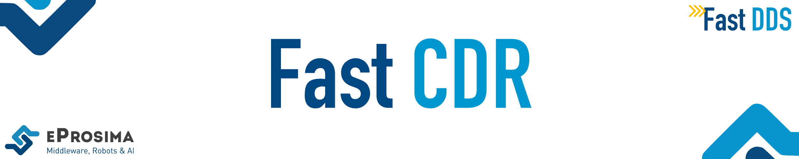

 

    <strong>
        <a href="https://eprosima.com/index.php/downloads-all">Download</a>
        &nbsp;&nbsp;•&nbsp;&nbsp;
        <a href="https://fast-dds.docs.eprosima.com/en/latest/">Docs</a>
        &nbsp;&nbsp;•&nbsp;&nbsp;
        <a href="https://eprosima.com/index.php/company-all/news">News</a>
        &nbsp;&nbsp;•&nbsp;&nbsp;
        <a href="https://x.com/EProsima">X</a>
        &nbsp;&nbsp;•&nbsp;&nbsp;
        <a href="mailto:info@eprosima.com">Contact Us</a>
    </strong>

  

    
    
    
    
    
     
    
    
    
    

  

*eProsima Fast CDR* is a C++ library that provides two serialization mechanisms.
One is the standard CDR serialization mechanism, while the other is a faster implementation that modifies the standard.

## Commercial support

Looking for commercial support? Write us to info@eprosima.com

Find more about us at [eProsima’s webpage](https://eprosima.com/).

## Build

**eProsima Fast CDR** provides [CMake][cmake] scripts to build and install it (please read the [installation guide](https://fast-dds.docs.eprosima.com/en/latest/installation/sources/sources_linux.html#cmake-installation) for more details).
Also, in [eProsima][eprosima] you can find packages for Linux using autotools and binaries for Windows.

[cmake]: http://www.cmake.org
[eprosima]: http://www.eprosima.com

## Quality Declaration

**eprosima Fast CDR** claims to be in the **Quality Level 1** category based on the guidelines provided by [ROS 2](https://ros.org/reps/rep-2004.html).
See the [Quality Declaration](QUALITY.md) for more details.
